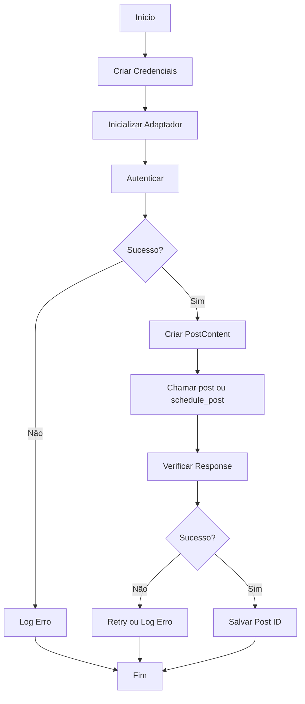

# Guia Completo de Implementação - Sistema de Postagens em Redes Sociais

**Autor**: Monica AI  
**Data de Criação**: 2026-02-04  
**Versão**: 1.1  
**Objetivo**: Expandir sistema Python existente com suporte a postagens automatizadas no Facebook e Instagram (Graph API v24.0), mantendo compatibilidade com Evolution API para WhatsApp.

---

## Índice

1. [Visão Geral](#visão-geral)
2. [Requisitos Técnicos](#requisitos-técnicos)
3. [Setup Inicial](#setup-inicial)
4. [Autenticação](#autenticação)
5. [Estrutura de Código](#estrutura-de-código)
6. [Guia de Uso](#guia-de-uso)
7. [Tratamento de Erros](#tratamento-de-erros)
8. [Boas Práticas](#boas-práticas)
9. [Troubleshooting](#troubleshooting)
10. [Referências](#referências)

---

## 1. Visão Geral

Este sistema foi desenvolvido para permitir postagens automatizadas em múltiplas plataformas sociais através de uma interface unificada em Python. O sistema mantém compatibilidade com a arquitetura existente baseada em Evolution API para WhatsApp, adicionando suporte para Facebook Graph API e Instagram Content Publishing API [1] [2].

### Principais Características

O sistema oferece as seguintes funcionalidades para cada plataforma:

**Facebook Graph API** [3]: Permite postar mensagens, imagens e vídeos em páginas do Facebook, com suporte a agendamento de publicações, hashtags e links. O sistema suporta ainda gerenciamento de engagement e análise de performance.

**Instagram Content Publishing API** [4]: Possibilita publicação de imagens, vídeos, reels e carousels em contas profissionais do Instagram, com limite de 100 posts por período de 24 horas e suporte a tags de usuário e localização.

**Arquitetura Modular**: Cada plataforma é encapsulada em um adaptador específico que herda de uma classe base comum, permitindo fácil extensão para outras plataformas no futuro.

---

## 2. Requisitos Técnicos

### Dependências de Software

Para executar este sistema, você precisará dos seguintes componentes:

- **Python 3.8 ou superior**: O código foi desenvolvido com sintaxe compatível com Python 3.8+
- **requests**: Biblioteca para fazer requisições HTTP
- **python-dotenv**: Para gerenciar variáveis de ambiente

### Instalação de Dependências

Para instalar as dependências necessárias, execute o comando abaixo em seu terminal:

```bash
pip install requests python-dotenv
```

Se você deseja usar a biblioteca oficial da Meta (facebook_business), também pode instalar:

```bash
pip install facebook-business
```

### Contas e Credenciais Necessárias

**Facebook**: É necessário ter uma página do Facebook gerenciada. Você precisa de permissão de administrador ou editor na página.

**Instagram**: Uma conta profissional do Instagram conectada a uma página do Facebook. Contas pessoais não suportam a API de publicação.

**Meta Developer Account**: Acesso a https://developers.facebook.com para criar a aplicação e gerar tokens.

---

## 3. Setup Inicial

### Passo 1: Criar Aplicação na Meta

Acesse https://developers.facebook.com/ e siga os passos:

1. Faça login ou crie uma conta
2. Clique em "Meus Aplicativos"
3. Clique em "Criar Aplicativo"
4. Selecione "Consumidor" como tipo
5. Preencha os dados da aplicação
6. Adicione os produtos "Facebook Login" e "Graph API"

### Passo 2: Obter Credenciais

Dentro do painel da aplicação:

1. Acesse "Configurações > Básico" para obter App ID e App Secret
2. Copie essas informações para local seguro

### Passo 3: Configurar Facebook Login

1. Acesse "Produtos > Facebook Login > Configurações"
2. Adicione URIs de redirecionamento válidas (para desenvolvimento, pode ser http://localhost:8000)
3. Configure domínios da aplicação

### Passo 4: Configurar Variáveis de Ambiente

Crie um arquivo `.env` na raiz do projeto com as seguintes variáveis:

```bash
# Facebook Configuration
FACEBOOK_ACCESS_TOKEN=seu_access_token_aqui
FACEBOOK_PAGE_ID=seu_page_id_aqui

# Instagram Configuration
INSTAGRAM_ACCESS_TOKEN=seu_instagram_token_aqui
INSTAGRAM_ACCOUNT_ID=seu_instagram_account_id_aqui

# Evolution API (se usandoo WhatsApp)
EVOLUTION_API_KEY=sua_chave_evolution_aqui
EVOLUTION_API_BASE_URL=https://api.evolution.local
```

**IMPORTANTE**: Nunca commitar o arquivo `.env` no repositório! Adicione-o ao `.gitignore`:

```
.env
*.pyc
__pycache__/
.DS_Store
```

---

## 4. Autenticação

### 4.1 Fluxo de Autenticação Facebook

O fluxo de autenticação do Facebook ocorre em três etapas:

**Etapa 1 - Autenticação do Usuário**: O usuário faz login via Facebook Login, que retorna um User Access Token válido por aproximadamente 60 dias (ou mais, dependendo da configuração).

**Etapa 2 - Obtenção do Page Access Token**: O User Access Token é usado para solicitar um Page Access Token específico para a página. Este token é necessário para postar conteúdo.

**Etapa 3 - Renovação de Tokens**: Facebook recomenda usar tokens de longa duração e implementar lógica de renovação automática antes da expiração.

### 4.2 Fluxo de Autenticação Instagram

Para Instagram, o processo é ligeiramente diferente:

**Etapa 1 - Conectar Conta Instagram**: Sua conta profissional do Instagram deve estar conectada a uma página do Facebook no Business Manager.

**Etapa 2 - Obtenção de Token**: O token pode ser obtido via Facebook Login com permissões `instagram_basic` e `instagram_content_publish`.

**Etapa 3 - Autorização**: Meta pode exigir aprovação adicional dependendo do volume de publicações.

### 4.3 Obtenção Manual de Tokens

Para teste rápido, você pode usar o Graph API Explorer em https://developers.facebook.com/tools/explorer/:

1. Selecione sua aplicação no dropdown
2. Clique em "Gerar Access Token"
3. **Adicione as Permissões Necessárias**:
   - `pages_manage_posts`
   - `pages_read_engagement`
   - `instagram_business_basic` (ou `instagram_basic`)
   - `instagram_business_content_publish` (ou `instagram_content_publish`)
4. **Importante**: No campo "Usuário ou Página", **selecione especificamente o nome da sua Página** (ex: "Achados Tec Brasil") em vez de deixar como "User Token". Isso gerará o **Page Access Token** correto necessário para o robô.
5. Copie o token gerado (começa com `EAA...`).

**Atenção**: Tokens do Graph Explorer expiram em poucas horas. Para produção, implemente fluxo de autenticação completo.

### 4.4 Obtendo IDs da Página e do Instagram

Com o **Token de Acesso da Página** selecionado no Graph API Explorer:

1. No campo de consulta, digite: `me?fields=id,name,instagram_business_account`
2. Clique em **Submit**.
3. No JSON de resposta:
   - O campo `id` na raiz é o seu **`FACEBOOK_PAGE_ID`**.
   - O campo `id` dentro de `instagram_business_account` é o seu **`INSTAGRAM_ACCOUNT_ID`**.

*Nota: Se o campo do Instagram não aparecer, verifique se sua conta do Instagram é Comercial/Criador e se está vinculada à Página do Facebook.*

---

## 5. Estrutura de Código

### 5.1 Arquitetura Geral

O sistema é organizado em três camadas principais:

**Camada de Adaptadores**: Contém classes específicas para cada plataforma (FacebookAdapter, InstagramAdapter) que encapsulam a lógica de autenticação e publicação.

**Camada de Modelos de Dados**: Define estruturas de dados como PostContent, Media e PostResponse que padronizam a informação entre plataformas.

**Camada de Aplicação**: Fornece o SocialMediaDispatcher para gerenciar múltiplos adaptadores e facilitar postagens em batch.

### 5.2 Fluxograma da Aplicação



### 5.3 Componentes Principais

**SocialMediaAdapter**: Classe abstrata que define interface comum para todos os adaptadores, incluindo métodos como `authenticate()`, `post()`, `schedule_post()` e `delete_post()`.

**FacebookAdapter**: Implementação específica para Facebook Graph API, handling de permissões e endpoints do Facebook.

**InstagramAdapter**: Implementação específica para Instagram, com suporte a múltiplos tipos de mídia e limite de taxa.

**SocialMediaDispatcher**: Gerenciador que registra múltiplos adaptadores e permite postagens em batch em todas as plataformas.

---

## 6. Guia de Uso

### 6.1 Exemplo Básico - Postar no Facebook

```python
from social_media_adapters import FacebookAdapter, PostContent
import os

# Configurar credenciais
credentials = {
    'access_token': os.getenv('FACEBOOK_ACCESS_TOKEN'),
    'page_id': os.getenv('FACEBOOK_PAGE_ID')
}

# Criar adaptador
fb = FacebookAdapter(credentials)

# Autenticar
if fb.authenticate():
    # Criar conteúdo
    content = PostContent(
        message="Olá Facebook!",
        hashtags=['teste', 'automação']
    )
    
    # Postar
    response = fb.post(content)
    
    if response.success:
        print(f"Post publicado: {response.post_id}")
    else:
        print(f"Erro: {response.message}")
else:
    print("Falha na autenticação")
```

### 6.2 Exemplo - Postar com Imagem no Instagram

```python
from social_media_adapters import InstagramAdapter, PostContent, Media, ContentType

credentials = {
    'access_token': os.getenv('INSTAGRAM_ACCESS_TOKEN'),
    'instagram_business_account_id': os.getenv('INSTAGRAM_ACCOUNT_ID')
}

ig = InstagramAdapter(credentials)

if ig.authenticate():
    # Criar mídia (URL PÚBLICA obrigatória)
    image = Media(
        url="https://seu-servidor.com/imagem.jpg",
        media_type=ContentType.IMAGE,
        alt_text="Descrição da imagem"
    )
    
    # Criar conteúdo
    content = PostContent(
        message="Novo post! 📸",
        media=[image],
        hashtags=['instagram', 'novo']
    )
    
    # Postar
    response = ig.post(content)
    print(f"Post: {response.post_id if response.success else response.message}")
```

### 6.3 Exemplo - Agendar Publicação

```python
from datetime import datetime, timedelta

# Agendar para 2 horas no futuro
publish_time = datetime.now() + timedelta(hours=2)

content = PostContent(
    message="Este post será publicado em 2 horas!"
)

# Facebook
response_fb = fb.schedule_post(content, publish_time)

# Instagram
response_ig = ig.schedule_post(content, publish_time)

print(f"Facebook agendado: {response_fb.post_id if response_fb.success else 'Erro'}")
print(f"Instagram agendado: {response_ig.post_id if response_ig.success else 'Erro'}")
```

### 6.4 Exemplo - Postar em Múltiplas Plataformas

```python
from social_media_adapters import SocialMediaDispatcher

# Criar despachador
dispatcher = SocialMediaDispatcher()

# Registrar adaptadores
dispatcher.register_adapter(fb)
dispatcher.register_adapter(ig)

# Criar conteúdo único
content = PostContent(
    message="Publicando em múltiplas plataformas! 🚀",
    hashtags=['multiplo', 'automação']
)

# Postar em todas
results = dispatcher.post_to_all(content)

# Verificar resultados
for platform, response in results.items():
    status = "✓" if response.success else "✗"
    print(f"{status} {platform}: {response.message}")
```

---

## 7. Tratamento de Erros

### 7.1 Tipos de Erros Comuns

**NOT_AUTHENTICATED**: Ocorre quando o adaptador não foi autenticado antes de tentar postar. Solução: Chamar `authenticate()` primeiro.

**INVALID_TOKEN**: Token expirado ou inválido. Solução: Gerar novo token via Graph API Explorer ou implementar refresh automático.

**RATE_LIMIT**: Excedido limite de publicações. Para Instagram: máximo 100 posts por 24 horas. Solução: Aguardar ou implementar fila de espera.

**INVALID_MEDIA_URL**: URL da mídia não é pública ou acessível. Solução: Verificar se URL está correta e servidor está online.

**MISSING_PERMISSIONS**: Permissões insuficientes. Solução: Adicionar permissões necessárias no aplicativo e re-autenticar.

### 7.2 Implementar Retry Logic

```python
import time
from functools import wraps

def retry_on_error(max_retries=3, delay=2):
    """Decorator para retry automático"""
    def decorator(func):
        def wrapper(*args, **kwargs):
            for attempt in range(max_retries):
                try:
                    return func(*args, **kwargs)
                except Exception as e:
                    if attempt < max_retries - 1:
                        print(f"Tentativa {attempt + 1} falhou, aguardando {delay}s...")
                        time.sleep(delay)
                    else:
                        raise
        return wrapper
    return decorator

@retry_on_error(max_retries=3, delay=2)
def post_with_retry(adapter, content):
    return adapter.post(content)
```

### 7.3 Logging Estruturado

```python
import logging
import json
from datetime import datetime

# Configurar logging
logging.basicConfig(
    level=logging.INFO,
    format='%(asctime)s - %(name)s - %(levelname)s - %(message)s',
    handlers=[
        logging.FileHandler('posts.log'),
        logging.StreamHandler()
    ]
)

logger = logging.getLogger('SocialMedia')

class PostLogger:
    @staticmethod
    def log_post_attempt(platform, content, response):
        log_data = {
            'timestamp': datetime.now().isoformat(),
            'platform': platform,
            'message': content.message[:50],  # Primeiros 50 caracteres
            'success': response.success,
            'post_id': response.post_id,
            'error_code': response.error_code,
            'error_message': response.message
        }
        
        if response.success:
            logger.info(f"Post bem-sucedido: {json.dumps(log_data)}")
        else:
            logger.error(f"Falha ao postar: {json.dumps(log_data)}")
```

---

## 8. Boas Práticas

### 8.1 Segurança

**Nunca incluir tokens no código**: Sempre use variáveis de ambiente via arquivo `.env` ou sistema de gerenciamento de secrets.

**Usar HTTPS**: Certifique-se de que todas as requisições à API usem HTTPS, nunca HTTP.

**Validar URLs de mídia**: Antes de postar, valide que as URLs de mídia são acessíveis e legítimas.

**Implementar rate limiting**: Respeite os limites de taxa de cada plataforma para evitar bloqueios.

### 8.2 Performance

**Implementar fila de publicação**: Para múltiplas postagens, use uma fila (Celery, RabbitMQ) para evitar gargalos.

**Cache de tokens**: Armazene tokens em cache com verificação de expiração antes de reutilizar.

**Requisições assíncronas**: Para múltiplas plataformas, considere usar `asyncio` ou `aiohttp` para requisições paralelas.

### 8.3 Monitoramento

**Registrar todas as tentativas**: Mantenha logs detalhados de todas as postagens, sucessos e falhas.

**Alertas para erros**: Configure alertas para erros críticos como falhas de autenticação.

**Métricas**: Acompanhe métricas como tempo de resposta, taxa de sucesso e uso de rate limit.

---

## 9. Troubleshooting

### Problema: "Invalid OAuth access token"

**Causa**: Token expirado ou inválido.  
**Solução**:
1. Verifique se o token está correto no arquivo `.env`
2. Gere um novo token no Graph API Explorer
3. Verifique se o token tem as permissões necessárias

### Problema: "User does not have permission to post"

**Causa**: Permissões insuficientes na página ou conta.  
**Solução**:
1. Verifique se você é administrador/editor da página
2. Adicione permissões `pages_manage_posts` no aplicativo
3. Re-autentique com as novas permissões

### Problema: Instagram: "Media URL must be publicly accessible"

**Causa**: URL da imagem não é pública ou servidor está offline.  
**Solução**:
1. Verifique se a URL é acessível via navegador
2. Certifique-se de que o servidor não requer autenticação
3. Verifique se há restrições de CORS

### Problema: Rate limit exceeded

**Causa**: Excedido limite de 100 posts por 24h no Instagram.  
**Solução**:
1. Aguarde 24 horas para reset automático
2. Distribua publicações ao longo do tempo
3. Considere usar múltiplas contas para volume maior

### Problema: TypeError ao usar adaptador

**Causa**: Credenciais ausentes ou inválidas.  
**Solução**:
```python
# Sempre verificar credenciais antes
required = ['access_token', 'page_id']
for cred in required:
    if cred not in credentials:
        raise ValueError(f"Credencial obrigatória faltando: {cred}")
```

---

## 10. Referências

[1]: https://developers.facebook.com/docs/graph-api/ "Facebook Graph API Documentation"

[2]: https://developers.facebook.com/docs/instagram-platform/content-publishing/ "Instagram Content Publishing API"

[3]: https://developers.facebook.com/docs/pages-api/posts/ "Facebook Pages API - Posts"

[4]: https://developers.facebook.com/docs/instagram-platform/instagram-graph-api/reference/ig-user/media/ "Instagram Graph API - Media"

---

## Apêndice A: Estrutura de Diretórios Recomendada

```
projeto-redes-sociais/
├── src/
│   ├── __init__.py
│   ├── social_media_adapters.py
│   ├── config.py
│   └── utils.py
├── examples/
│   ├── exemplo_1_simples.py
│   ├── exemplo_2_com_imagem.py
│   └── exemplo_3_agendado.py
├── tests/
│   ├── test_facebook.py
│   ├── test_instagram.py
│   └── test_dispatcher.py
├── logs/
│   └── posts.log
├── .env.example
├── .gitignore
├── requirements.txt
├── README.md
└── LICENSE
```

## Apêndice B: Template requirements.txt

```
requests>=2.28.0
python-dotenv>=0.20.0
facebook-business>=18.0.0
pytest>=7.0.0
pytest-mock>=3.10.0
```

## Apêndice C: Modelo de Post Estruturado

```python
{
    "message": "Texto do post",
    "media": [
        {
            "url": "https://exemplo.com/imagem.jpg",
            "type": "image",
            "alt_text": "Descrição da imagem"
        }
    ],
    "hashtags": ["tag1", "tag2"],
    "mentions": ["@usuario1", "@usuario2"],
    "location": "São Paulo, Brasil",
    "publish_time": "2026-02-04T15:30:00"
}
```

---

**Fim do Guia de Implementação**

Este documento será atualizado conforme novas funcionalidades e melhorias forem implementadas. Para sugestões ou relatório de bugs, consulte a documentação oficial da Meta em https://developers.facebook.com/docs/.
