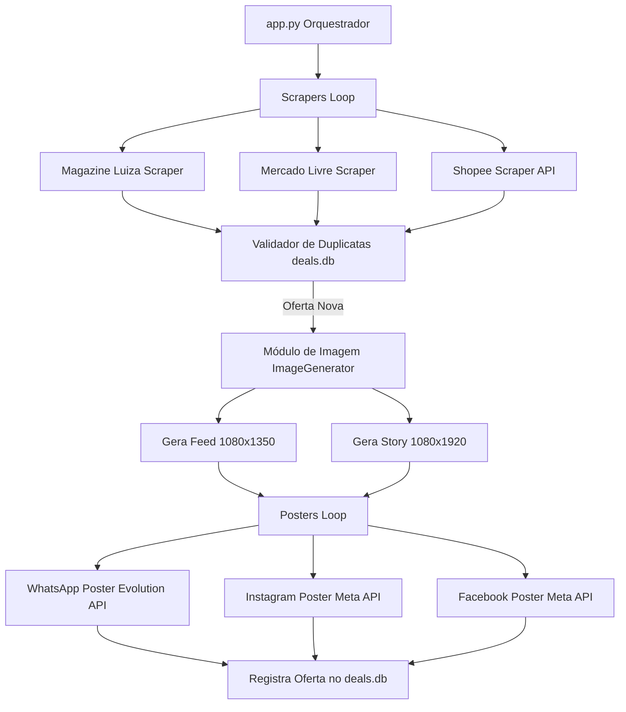

# Arquitetura Técnica Detalhada - Offer Flow

Este documento fornece uma visão aprofundada da arquitetura técnica, fluxo de dados e design do sistema **Offer Flow**, mapeando os módulos existentes, as lógicas de automação (incluindo as integrações com Mercado Livre e Magazine Luiza) e as melhorias futuras mapeadas.

---

## 1. Visão Geral do Sistema

O **Offer Flow** é uma aplicação de automação que realiza o ciclo completo de curadoria de ofertas: captação, higienização, personalização visual e postagem multicanal de forma síncrona.

---

## 2. Funcionamento Interno dos Módulos

### 2.1. Magazine Luiza Scraper (`scrapers/magazine_luiza.py`)
O scraper do Magazine Luiza executa a navegação utilizando `undetected_chromedriver` para evitar detecção de bots.
*   **Coleta na Listagem:** Acessa a URL da categoria rotacionada e extrai os metadados dos produtos dos cards (`[data-testid="product-card-container"]`).
*   **Extração de Imagem HQ e Cupom:** Para cada produto candidato que não esteja no banco de dados, o bot navega até o link do anúncio.
    *   **Imagem HQ:** Aguarda e captura o elemento `[data-testid="image-selected-thumbnail"]`.
    *   **Lógica de Cupons:** Busca o campo de input de cupom (`input[data-testid="coupon-code-input"]`) e extrai o código (atributo `value`). Adicionalmente, localiza o contêiner de desconto (`[data-testid="coupon-code-copy"] strong`) para obter o valor do desconto (ex: `R$ 300 OFF`).
*   **Persistência de Sessão:** Utiliza o diretório local `sessao_chrome` para manter o estado do navegador e evitar logins frequentes.

### 2.2. Mercado Livre Scraper (`scrapers/mercado_livre.py`)
Utiliza requisições HTTP e automação de navegador para capturar ofertas e convertê-las em links de afiliado.
*   **Resolução de Filtros de Desconto:** Higieniza e preserva os parâmetros `pdp_filters` nos links capturados. Isso garante que a oferta e o desconto ativo (ex: ofertas do dia) carreguem corretamente quando o usuário clicar no link de afiliado.
*   **Extração de Cupons do Card:** Durante a varredura da listagem de ofertas, localiza elementos da classe `poly-coupons__pill` nos cards de produto. Caso existam, extrai e higieniza a informação de desconto (ex: removendo o prefixo "Cupom " para manter "10% OFF" ou "R$ 30 OFF") e preenche o atributo `cupom_desconto` da oferta.
*   **Geração de Links de Afiliado:**
    *   O bot navega até o Link Builder do Mercado Livre (`https://www.mercadolivre.com.br/afiliados/linkbuilder`).
    *   Injeta o link original no input de conversão e executa um script JS diretamente no console do navegador para chamar a API `/createLink` oficial, contornando a proteção contra cliques automatizados.
    *   Retorna a URL encurtada final sob o domínio `meli.la` vinculada à tag de afiliado configurada no `.env`.

### 2.3. Image Generator (`utils/image_generator.py`)
Gera imagens promocionais dinâmicas com a identidade visual da marca utilizando a biblioteca `Pillow (PIL)`.
*   **Formatos Suportados:**
    *   `feed`: Imagem retangular vertical (1080x1350) otimizada para o feed do Instagram/Facebook.
    *   `story`: Imagem vertical longa (1080x1920) otimizada para Stories e Status do WhatsApp.
*   **Badge de Cupom Dinâmica:** Se o parâmetro `cupom_codigo` estiver presente na oferta, desenha um selo (badge) retangular arredondado com fundo carmesim escuro (`#B71C1C`) e texto em fonte extra-grossa (`Montserrat-Black` com fallback para `Arial Black`), contendo o código e o desconto do cupom na parte superior esquerda da imagem do produto.
*   **Ajuste Dinâmico de Texto:** Dimensiona dinamicamente os tamanhos das fontes do título, preço original riscado ("DE: R$ ...") e parcelamento ("Por apenas ...") para evitar que textos longos estourem as margens do template.

### 2.4. Posters de Redes Sociais (`social/`)
*   **WhatsApp (`whatsapp_poster.py`):**
    *   Utiliza a **Evolution API** via requisições HTTP para enviar imagens geradas com legendas estruturadas para grupos/contatos.
    *   Adiciona a formatação de cupom `🎟️ *Cupom:* `CUPOM` (Desconto)` antes da linha do preço.
    *   Usa a formatação de código monoespaçado (crases/backticks) para permitir cópia rápida com apenas um toque no celular.
*   **Instagram (`instagram_poster.py`) e Facebook (`facebook_poster.py`):**
    *   Conectam-se à **API Graph do Facebook** para publicação no Feed e Stories.
    *   O poster de Instagram hospeda temporariamente a imagem gerada localmente no Imgur como fallback e depois publica a URL hospedada no feed do Instagram.
    *   Troca dinamicamente o User Access Token do desenvolvedor pelo Page Access Token específico para evitar problemas de escopo.

### 2.5. Utilitários Globais
*   **DualLogger (`app.py`):** Uma classe de logger que escreve saídas para o console e arquivos de log. Possui um mecanismo de rotação diária automática de arquivos de log e trata caracteres UTF-8 de forma segura para evitar erros de codificação em terminais Windows (`cp1252`).
*   **Review Mode (Modo de Revisão):** Quando ativado no `.env` (`REVIEW_MODE="true"`), o orquestrador intercepta todas as publicações normais e redireciona os posts formatados e imagens de Stories para grupos específicos de WhatsApp (`WHATSAPP_REVIEW_GROUP_ID` e `WHATSAPP_STORY_REVIEW_GROUP_ID`) para que o administrador possa validar as ofertas manualmente antes de postá-las no canal público.

---

## 3. Banco de Dados

O banco de dados do sistema utiliza **SQLite** (`deals.db`) gerenciado pelo módulo `database/database.py`.

### Tabela: `deals`
Armazena as ofertas capturadas e publicadas para evitar duplicidade.
*   `link` (TEXT, PRIMARY KEY): O link original ou convertido da oferta.
*   `title` (TEXT): O título do produto capturado.
*   `created_at` (TIMESTAMP): Data e hora em que a oferta foi salva (padrão: `CURRENT_TIMESTAMP`).

---

## 4. O que Está Faltando / Roadmap de Melhorias Futuras

### 4.1. Renovação Automática e Monitoramento de Sessões do Chrome
*   **Status Atual:** Os scrapers dependem das sessões salvas no diretório `sessao_chrome` para Mercado Livre e Magazine Luiza. Se os cookies expirarem ou a conta for deslogada, o processo de afiliado ou scraping falhará silenciosamente no console.
*   **Solução Proposta:** Implementar uma rotina de verificação no início de cada ciclo que tenta acessar um endpoint restrito (como `/my-account` ou `/linkbuilder`) e, caso detecte deslogamento, dispare um alerta crítico no grupo do WhatsApp (`WHATSAPP_ERROR_GROUP_ID`) solicitando intervenção ou execute um login automatizado secundário.

### 4.2. Fila de Mensagens com Rate Limiting Dinâmico
*   **Status Atual:** O sistema publica as ofertas em sequência direta com pequenos delays de `time.sleep(10)`. Em ciclos com muitas ofertas novas, postar muitas mídias seguidas pode acionar restrições contra spam ou rate limits nas APIs do WhatsApp (Evolution API) e Meta.
*   **Solução Proposta:** Criar uma tabela de fila de postagens (`post_queue`) no banco de dados SQLite. Um processo worker separado pegaria as postagens da fila e as enviaria com intervalos dinâmicos baseados no volume diário, prevenindo bloqueios de contas.

### 4.3. Migração do Schema do Banco de Dados
*   **Status Atual:** A tabela `deals` armazena apenas links e títulos. Não há histórico detalhado sobre preços anteriores, métricas de engajamento dos posts, cliques ou registro de erros específicos por oferta.
*   **Solução Proposta:** Expandir o schema para incluir:
    *   `price` (REAL) e `original_price` (REAL)
    *   `platform` (TEXT: magalu, mercado_livre, shopee)
    *   `coupon_code` (TEXT)
    *   `post_status` (TEXT: pending, posted, failed)
    *   `error_log` (TEXT)

### 4.4. Execução Autônoma Verdadeira do Chrome em Headless Mode
*   **Status Atual:** O scraper do Mercado Livre com `undetected_chromedriver` rodando em modo `--headless` dispara barreiras de detecção Cloudflare / 403. Ele precisa rodar em GUI visível no sistema operacional para passar na verificação.
*   **Solução Proposta:** Utilizar técnicas avançadas de stealth, como a biblioteca `selenium-stealth`, injeções personalizadas de cabeçalho via extensões do Chrome em modo headless ou utilizar APIs privadas de parceiros do Mercado Livre para evitar dependência do navegador de interface gráfica.

### 4.5. Interface Administrativa Web (Dashboard)
*   **Status Atual:** O monitoramento é feito lendo os arquivos `app.log` ou as mensagens enviadas no grupo de erros do WhatsApp. A curadoria de cupons e rotações de URLs requer modificações manuais no arquivo `.env`.
*   **Solução Proposta:** Criar um painel simples (usando Streamlit ou Flask + HTML premium) onde o administrador possa:
    *   Visualizar as últimas ofertas capturadas.
    *   Alterar e testar as URLs de categorias do Magazine Luiza.
    *   Configurar os valores de margem de preços e limites mínimos de postagem.
    *   Visualizar estatísticas de erros e alertas do bot.
